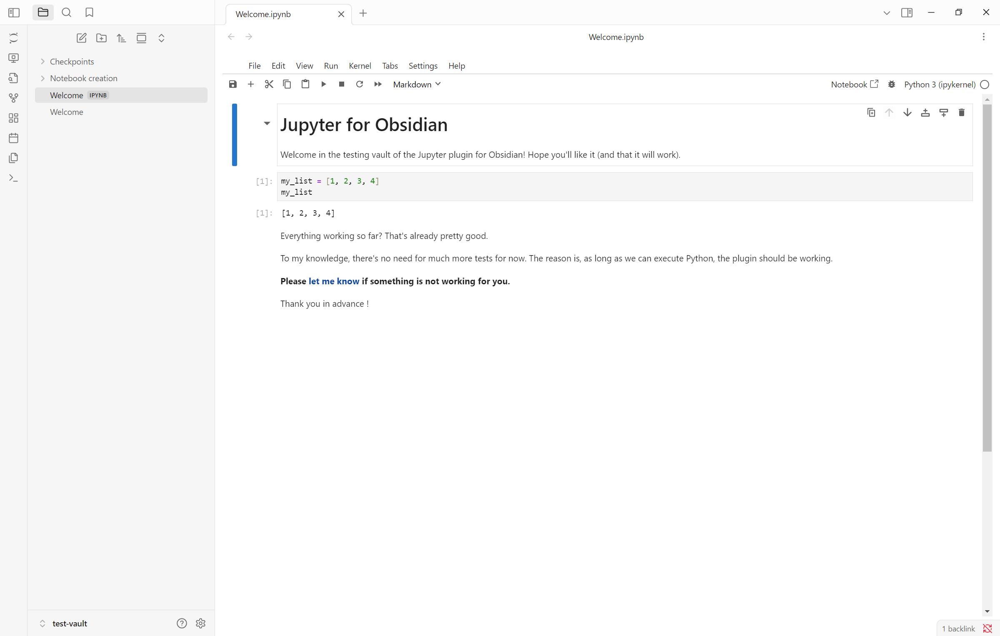

<h1 align="center">
     
    
     
    Jupyter for Obsidian
     
</h1>

<h4 align="center">
    Run and use Jupyter notebooks without ever leaving Obsidian.
</h4>

    
    

    <a href="https://jupyter.mael.im/handbook/">User Guide</a> •
    <a href="https://jupyter.mael.im/handbook/troubleshooting/">Troubleshooting</a> •
    <a href="https://jupyter.mael.im/contribute/">Contribute</a>

    

Open `.ipynb` files with Jupyter Notebook or Jupyter Lab directly within the Obsidian editor. Edit notebooks and run their code blocks with ease.

## Features

- **`.ipynb` support**

    See, open and edit `.ipynb` files inside Obsidian

- **Embed notebooks in other notes**

    Reference a notebook from another note with `![[notebook.ipynb]]`, in reading mode, Live Preview, and as a hover preview.

- **Jupyter server management**

    Start and stop Jupyter without ever seeing a terminal, using Obsidian commands and/or ribbon icons.

- **Checkpoints deletion**

    Configure the plugin to automatically delete Jupyter checkpoints to keep the vault clean.

- **Simple interface**

    By default, the simple interface mode of Jupyter is used, leading to an uncluttered editor.
